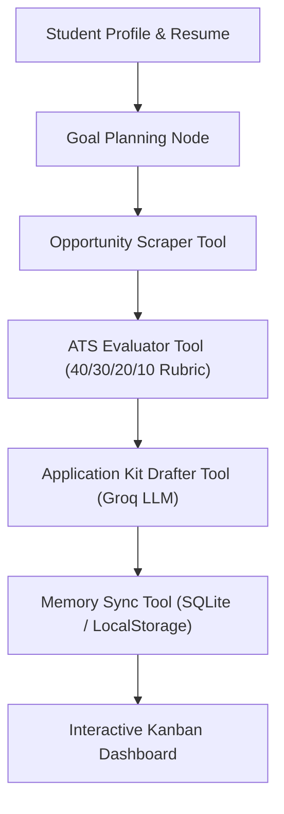

# InternX — Autonomous AI-Powered Internship Agent

> **DeltaCCE Agentic AI Product Build Sprint — Official Submission**


---

## 📌 1. Project Overview

- **Project Title:** InternX — Autonomous AI-Powered Internship Agent
- **Team Name:** Team InternX
- **Track:** Education & Career Tech

### 👥 Team Members
1. **Trimil Triliver John**
2. **Vimal Jimmy**
3. **Jefin Joseph**

---

## 🎯 2. Problem Statement

College students struggle to find suitable internships because opportunities are scattered across multiple hiring platforms (LinkedIn, Unstop, Glassdoor, Internshala). The manual effort required to search, verify eligibility, tailor resumes, write pitch notes, and track application pipelines is overwhelming and error-prone.

---

## 💡 3. Solution Overview

**InternX** is an autonomous AI agent platform that automates the end-to-end internship discovery and application workflow:
1. **Ingests Student Profile & Resume:** Extracts skills, degree, major, GPA, and preferences.
2. **Autonomous Opportunity Scraper:** Scrapes/fetches opportunities across 6 tech domains.
3. **ATS Rubric Scorer:** Evaluates eligibility and calculates compatibility scores using a strict 40/30/20/10 weighted formula.
4. **Tailored Application Kit Generator:** Auto-generates customized cover letters, pitch notes, and highlights skill gaps.
5. **Persistent Kanban Memory:** Tracks application state across Discovered, Eligible, Applied, Interviewing, and Offer stages.

---

## 🛠️ 4. Tech Stack & Architecture

| Layer | Technologies Used | Purpose |
| :--- | :--- | :--- |
| **Frontend UI** | React + TypeScript + Vite, Tailwind CSS | High-performance student dashboard & live agent execution console |
| **Backend API** | Python 3.10+ & FastAPI | REST API endpoints for profile ingestion, scoring, and pipeline state |
| **AI Agent Engine** | Groq SDK (`llama-3.3-70b-versatile`) | Sub-second LLM reasoning for ATS compatibility & cover letter generation |
| **Database** | SQLite (`internx.db`) + LocalStorage | Dual-layer persistent application pipeline storage |

---

## 🤖 5. Agentic AI Architecture & Execution Loop



### ⚙️ The 5 Autonomous Execution Steps:
1. **Node 1 — Goal Planning:** Analyzes student profile attributes (GPA, skills, target roles).
2. **Node 2 — Scraper Tool:** Fetches relevant opportunities across AI/ML, Full Stack, Data Science, Security, UI/UX, and Product.
3. **Node 3 — ATS Evaluator Tool:** Applies 40% Core Skills, 30% Eligibility, 20% Preferred Tools, 10% Domain Alignment.
4. **Node 4 — App Kit Drafter Tool:** Uses Groq LLM to synthesize tailored pitch notes and cover letters.
5. **Node 5 — Memory Sync Tool:** Persists evaluated application states into the Kanban board.

---

## 📊 6. ATS Rubric Scoring Engine Formula

$$\text{Total Score} = (0.40 \times \text{Core Skills Match}) + (0.30 \times \text{Eligibility Score}) + (0.20 \times \text{Preferred Tools Match}) + (0.10 \times \text{Domain Alignment})$$

*If candidate GPA < Minimum Required GPA, Eligibility Score drops to **0%**, preventing ineligible applications.*

---

## 📁 7. Repository Directory Structure

```text
Team-InternX/
├── index.html              # Main standalone web dashboard
├── app.js                  # Agent execution engine & trace logger
├── style.css               # Modern dark theme styles
├── START-INTERNX.bat       # 1-Click launcher script for Windows
├── run-backend.bat         # FastAPI backend server launcher
├── run-frontend.bat        # React Vite frontend server launcher
├── backend/                # Python FastAPI server
│   ├── main.py             # REST API endpoints
│   ├── agent.py            # Groq LLM agent & rubric scorer
│   ├── database.py         # SQLite database initialization
│   ├── models.py           # Pydantic schemas
│   └── seed_data.py        # 18 seed internship listings
├── frontend/               # React + TypeScript Vite Web App
│   ├── src/                # React UI components
│   └── package.json
└── README.md               # Project documentation
```

---

## 🚀 8. How to Run locally

### Option 1: 1-Click Batch Launcher (Windows)
Right-click `START-INTERNX.bat` ➔ **Run as Administrator** or double-click to launch backend & frontend automatically!

### Option 2: Manual Terminal Execution
```bash
# 1. Start Backend API Server
cd backend
python -m uvicorn main:app --reload --port 8001

# 2. Start Frontend Dev Server
cd frontend
npm install
npm run dev
```

Open **`http://localhost:5173`** (or `index.html`) in your web browser!

---

## 👥 9. Team Contact
- **Trimil Triliver John**
- **Vimal Jimmy**
- **Jefin Joseph**
- **Repository:** [https://github.com/soulcrusher5643-cell/Agentic-AI-T4](https://github.com/soulcrusher5643-cell/Agentic-AI-T4)
