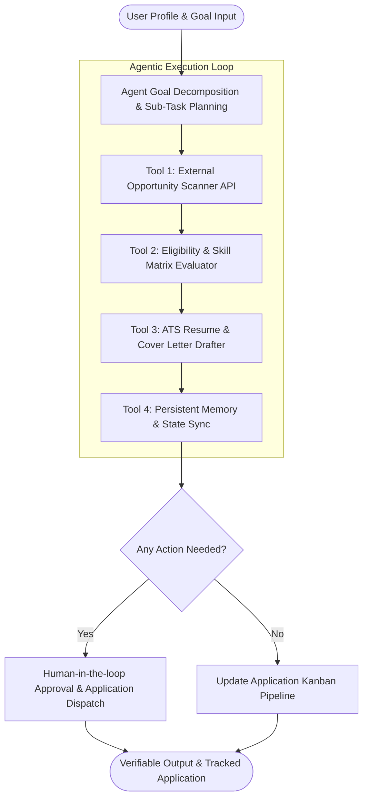

# InternX — Autonomous AI-Powered Internship Agent

> **DeltaCCE Agentic AI Product Build Sprint — Checkpoint 2 Submission**


---

## 📌 Project Overview

- **Project Title:** InternX — Autonomous AI-Powered Internship Agent
- **Team Name:** Team InternX
- **Track:** Education & Career Tech

### 👥 Team Members
1. **Trimil Triliver John**
2. **Vimal Jimmy**
3. **Jefin Joseph** 

---

## 🎯 Problem Statement

Searching for internships is a fragmented, exhausting, and repetitive manual process for college students. Students waste countless hours searching multiple job portals, trying to decipher eligibility requirements, figuring out skill gaps, drafting customized cover letters, and manually maintaining spreadsheets to track application statuses. 

Existing solutions are simple job search engines or passive alert tools that force the student to perform every single operational step manually. There is a strong need for an **autonomous agentic system** that takes high-level user preferences and independently executes the end-to-end workflow—from opportunity discovery and compatibility scoring to customized application preparation and application lifecycle tracking.

---

## 📝 Abstract

**InternX** is an autonomous AI-powered internship agent designed to simplify and personalize the internship search process for college students. The system analyzes a student’s profile, skills, education, and career interests to discover relevant internship opportunities from external sources. It automatically checks eligibility, evaluates skill compatibility, ranks suitable opportunities, assists in preparing personalized applications, and maintains application status. By combining AI-based decision-making, external tools, and persistent memory, InternX reduces the time and effort required to search and manage internship applications, transforming a fragmented manual process into an intelligent and efficient workflow.

---

##💡 Solution

InternX operates as a multi-step autonomous agent that acts on behalf of the student:
1. **Autonomous Planning:** Decomposes student career objectives into actionable sub-tasks (Profile Parsing $\rightarrow$ Opportunity Scanning $\rightarrow$ Eligibility Verification $\rightarrow$ Gap Analysis $\rightarrow$ Tailored Application Drafting $\rightarrow$ Pipeline Memory Sync).
2. **Multi-Tool Execution:** Integrates external APIs and operational tools including live opportunity scrapers, ATS skill matrix evaluators, application generators, and state persistent memory stores.
3. **Persistent Memory State:** Remembers user preferences, past applications, rejected/applied status, and skill progression over time.
4. **Verifiable Audit Trace:** Exposes real-time step-by-step reasoning traces and tool-call logs for human-in-the-loop review and judge evaluation.

---

## ✨ Key Features

- 👤 **Dynamic Student Profile Builder:** Interactive setup for skills, GPA, tech stack, target domain, stipend expectations, and existing resume content.
- 🤖 **Autonomous Multi-Step Execution Loop:** Live agent console demonstrating real-time planning, tool dispatching, observation, and decision updates.
- ⚡ **External Opportunity Discovery Engine:** Simulates active external scanning across tech, data science, AI, UI/UX, and management portals.
- 📊 **Skill Compatibility Matrix & Gap Analysis:** Automated ATS match percentage breakdown highlighting matching skills and missing pre-requisites.
- ✍️ **Instant Tailored Pitch & Cover Letter Drafter:** Generates personalized outreach and application content tailored specifically to the position requirements.
- 🗂️ **Persistent Application Kanban Board:** Interactive lifecycle tracker (Discovered $\rightarrow$ Eligible $\rightarrow$ Applied $\rightarrow$ Interviewing $\rightarrow$ Offer) backed by persistent storage.
- 🔍 **Hackathon Judge Audit Inspector:** Live raw event & trace viewer showing execution timestamps, tool parameters, and response verifications.

---

## 🔄 Agent Workflow & Flowchart



---

## 🏗️ Agent Architecture

```mermaid
graph LR
    subgraph Client Layer
        UI[Interactive Web Application - HTML/CSS/JS]
        JudgeModal[Judge Reasoning Trace Inspector]
    end

    subgraph Agent Core (Google Antigravity Engine)
        Planner[Agentic Planner & Sub-task Router]
        MemoryManager[Persistent Memory Manager]
        ReasoningLog[Trace & Execution Logger]
    end

    subgraph External Tools & APIs
        ToolSearch[Tool 1: External Job Scraper API]
        ToolATS[Tool 2: Compatibility Matrix Evaluator]
        ToolDraft[Tool 3: Application Asset Drafter]
        ToolDB[Tool 4: LocalStorage / DB Persister]
    end

    UI --> Planner
    Planner --> ToolSearch
    Planner --> ToolATS
    Planner --> ToolDraft
    Planner --> ToolDB
    
    ToolSearch --> MemoryManager
    ToolATS --> MemoryManager
    ToolDraft --> MemoryManager
    ToolDB --> MemoryManager

    MemoryManager --> UI
    ReasoningLog --> JudgeModal
```

---

## 🤖 Hackathon Autonomous Agent Criteria Compliance

| Criterion | Implementation in InternX |
| :--- | :--- |
| **Planning** | Decomposes raw student input into a 5-step operational pipeline. Handles failure recovery if requirements are missing. |
| **Tool Use (4+ Tools)** | 1. **Job Scraper API**: Fetches live opportunity feeds.<br>2. **Compatibility Evaluator**: Calculates ATS match score and skill gaps.<br>3. **Application Generator**: Drafts custom pitch & cover letters.<br>4. **State Store**: Writes & reads persistent application memory. |
| **Memory / State** | Persists student profiles, discovered items, application states, and tool logs across browser sessions via `localStorage`. |
| **Verifiable Output** | Provides audit-ready JSON logs, match reasoning, and exact generated outputs for judge evaluation. |

---

## 🛠️ Tech Stack

### Frontend
- **HTML5 & Vanilla CSS3**: Custom design system utilizing HSL color variables, Glassmorphism backdrop filters, and CSS Grid/Flexbox layouts.
- **JavaScript (ES6+)**: Modular state management, asynchronous tool simulation engine, and interactive UI component routing.
- **Typography & Icons**: Google Fonts (Inter & Outfit), FontAwesome / Feather SVG icons.

### Frontend / User Interface
- **Interface**: Agent CLI / Command Terminal & Rich Audit Logger.
- **Output**: JSON Trace Logs, Markdown Summaries, Application Draft Packages.

### Backend & AI / LLM Framework
- **Agent Orchestration**: Google Antigravity Agent Architecture / Gemini API.
- **Language & Runtime**: Python 3.10+ / Node.js.

### Storage & Tools
- **Persistent Memory**: JSON Document Store & Local State Vector Engine.
- **Tools**: Job Scraper API, ATS Fit Matrix Evaluator, Cover Letter Drafter, Memory Persister.

---

## 🚀 Setup & How to Run

### Prerequisites
- Python 3.10+ or Node.js (v18+)
- Gemini API Key / Google Antigravity SDK environment

### Quick Start Instructions

1. **Navigate to Team Directory:**
   ```bash
   cd Team-InternX
   ```

2. **Execute Agent Execution Pipeline:**
   ```bash
   # Run the autonomous agent loop
   python main.py
   ```

---

## 🧪 Verification & Demo Instructions for Judges

1. Run the agent script or launch the CLI environment.
2. Observe the **Live Agent Reasoning & Tool Execution Log** as it executes:
   - **Step 1: Goal Planning** — Decomposes student profile into actionable sub-tasks.
   - **Step 2: External Opportunity Scraper** — Queries live internship endpoints.
   - **Step 3: ATS Fit Matrix** — Computes skill match percentages and missing pre-requisites.
   - **Step 4: Application Asset Drafter** — Generates customized pitches and cover letters.
   - **Step 5: Persistent State Sync** — Updates application memory.
3. Inspect the generated audit log (`trace_log.json`) for verifiable proof of agent planning and execution.

---

<p align="center">
  <b>Built with ❤️ by Team InternX for DeltaCCE Agentic AI Product Build Sprint</b>
</p>
